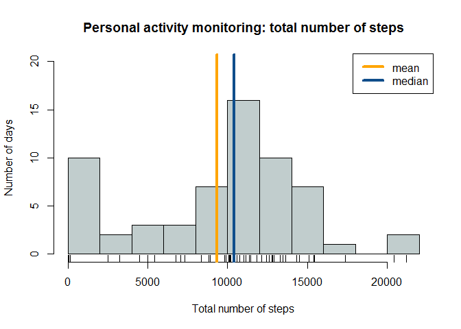
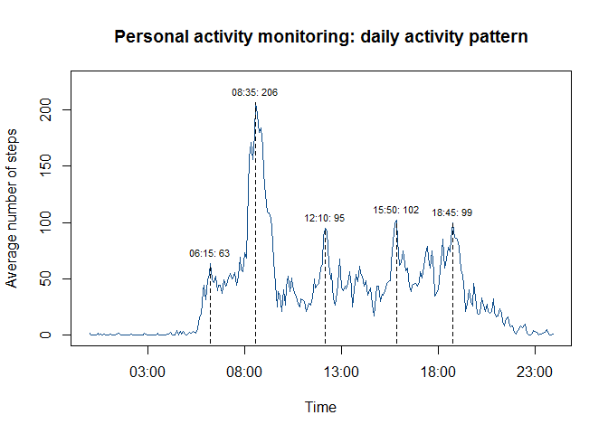
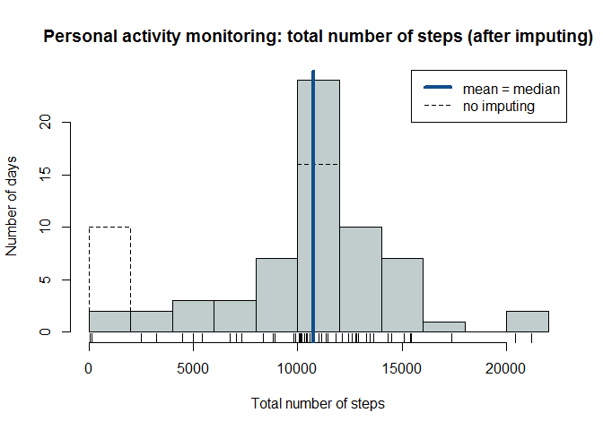
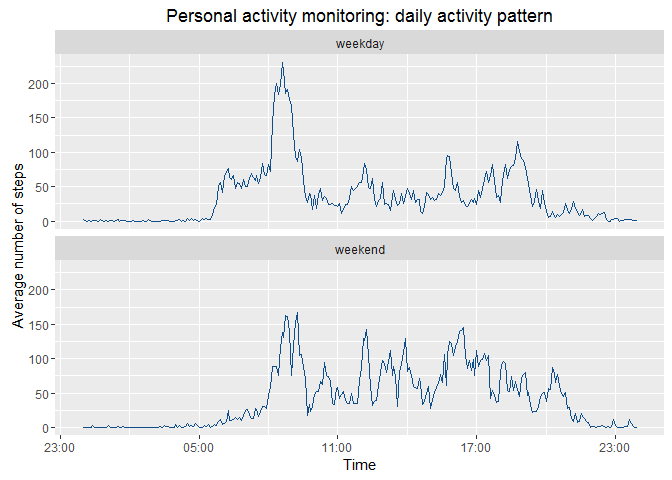

# Reproducible Research: Peer Assessment 1


## Introduction
It is now possible to collect a large amount of data about personal movement 
using activity monitoring devices such as a [Fitbit](www.fitbit.com), [Nike Fuelband](www.nike.com/us/en_us/c/nikeplus-fuelband), or
[Jawbone Up](https://jawbone.com/up). These type of devices are part of the 
"quantified self" movement - a group of enthusiasts who take measurements about
themselves regularly to improve their health, to find patterns in their 
behavior, or because they are tech geeks. But these data remain under-utilized 
both because the raw data are hard to obtain and there is a lack of 
statistical methods and software for processing and interpreting the data.

This analysis makes use of data from a personal activity monitoring device.
This device collects data at 5 minute intervals through out the day. 
The data consists of two months of data from an anonymous individual 
collected during the months of October and November, 2012 and include the 
number of steps taken in 5 minute intervals each day.

## Loading and preprocessing the data
The data for this assignment can be downloaded from the 
[Coursera Reproducable Research](https://www.coursera.org/learn/reproducible-research/) 
course web site:

[Activity monitoring data](https://d396qusza40orc.cloudfront.net/repdata%2Fdata%2Factivity.zip) [52K]

If the ZIP file `activity.zip` is not found in the working directory it is 
downloaded.


```r
dataZIP <- "activity.zip"
if (!(file.exists(dataZIP))) {
    downloadURL <- paste("https://d396qusza40orc.cloudfront.net/",
                         "repdata%2Fdata%2Factivity.zip",
                         sep = "")
    download.file(downloadURL, dataZIP)
}
```

The ZIP file includes a single CSV file `activity.csv`, containing a dataset of 
17,568 observations and the following 3 variables:

- steps: Number of steps taking in a 5-minute interval(missing values are coded
as NA)
- date: The date on which the measurement was taken in YYYY-MM-DD format
- interval: Identifier for the 5-minute interval in which measurement was taken

The dataset is loaded into R. Because the resulting `date` is formatted as 
a Factor it is converted to a date. The `interval` variable is 
converted to a factor with values equal to the time of the day 
corresponding to the original (integer) values. Some examples:

- "0" &rarr; "00:00:00"
- "435" &rarr; "04:30:00"
- "2055" &rarr; "20:55:00"

After the transformations the summary of the dataset is shown.


```r
activity <- read.csv(unz(dataZIP, "activity.csv"))
# convert date
activity$date <- as.Date(activity$date, "%Y-%m-%d")
# convert interval values to a factor
uniqueInterval <- unique(activity$interval)
h <- uniqueInterval %/% 100
m <- uniqueInterval - (h * 100)
timeLevels <- apply(cbind(h, m), 2, function(x) sprintf("%02d", x))
timeLevels <- paste(timeLevels[, 1], timeLevels[, 2], sep = ":")
activity$interval <- factor(activity$interval, labels = timeLevels)
str(activity)
```

```
## 'data.frame':	17568 obs. of  3 variables:
##  $ steps   : int  NA NA NA NA NA NA NA NA NA NA ...
##  $ date    : Date, format: "2012-10-01" "2012-10-01" ...
##  $ interval: Factor w/ 288 levels "00:00","00:05",..: 1 2 3 4 5 6 7 8 9 10 ...
```

```r
summary(activity)
```

```
##      steps             date               interval    
##  Min.   :  0.00   Min.   :2012-10-01   00:00  :   61  
##  1st Qu.:  0.00   1st Qu.:2012-10-16   00:05  :   61  
##  Median :  0.00   Median :2012-10-31   00:10  :   61  
##  Mean   : 37.38   Mean   :2012-10-31   00:15  :   61  
##  3rd Qu.: 12.00   3rd Qu.:2012-11-15   00:20  :   61  
##  Max.   :806.00   Max.   :2012-11-30   00:25  :   61  
##  NA's   :2304                          (Other):17202
```
The summary shows that the `steps` variable has 2,304 missing values. These
missing values are ignored for now but will be imputed in a later step of the
analysis.

## What is mean total number of steps taken per day?
In this step the mean and median of the total number of steps per day is
calculated.

The dataset contains 288 observations per day for a period of 61 days between
October 1, 2012 and 30 November, 2012 (resulting in the total number of
observations 288 x 61 = 17,568). 

For each of these days the total number of steps is calculated and 
shown in the histogram below. 


```r
totalSteps <- tapply(activity$steps, activity$date, sum, na.rm = TRUE)
# plot the histogram
hist(x = totalSteps,
     breaks = 15,
     main = "Personal activity monitoring: total number of steps",
     col = "azure3",
     xlab = "Total number of steps",
     ylab = "Number of days",
     ylim = c(0, 20))
rug(totalSteps)
# show the mean and median
abline(v = mean(totalSteps), col = "orange", lwd = 4)
abline(v = median(totalSteps), col = "dodgerblue4", lwd = 4)
legend("topright",
       lty = c(1, 1),
       col = c("orange", "dodgerblue4"),
       lwd = 4,
       legend = c("mean", "median"))
```



The histogram shows the mean and the median total number of steps visually.

The numerical values are the following:


```r
mean(totalSteps)
```

```
## [1] 9354.23
```

```r
median(totalSteps)
```

```
## [1] 10395
```
Mainly because of the large number of days in the leftmost bin
[0 steps, 2000 steps] of the plot the mean value is approximately
1041
steps below the median value.

## What is the average daily activity pattern?
In this step the number of steps taken is averaged across all days is
calculated and shown in a time-series plot. Five daily activity peaks are 
also shown on the plot. For this the local maxima are found in five hour 
intervals 05:00 &rarr; 07:00, 07:00 &rarr; 10:00, 12:00 &rarr; 14:00, 
15:00 &rarr; 17:00 and 18:00 &rarr; 22:00


```r
activityPattern <- tapply(activity$steps, activity$interval, mean, na.rm = TRUE)
plot(x = strptime(rownames(activityPattern), format="%H:%M"),
     y = activityPattern,
     type = "l",
     main = "Personal activity monitoring: daily activity pattern",
     xlab = "Time",
     ylab = "Average number of steps",
     col = "dodgerblue4",
     ylim = c(0, 225))
# generate matrix of 5 time intervals
timeInterval <- c("05:00", "07:00", "07:00", "10:00", "12:00",
              "14:00", "15:00", "17:00", "18:00", "22:00")
timeInterval <- match(timeInterval, rownames(activityPattern))
timeInterval <- matrix(timeInterval, nrow = 2, ncol = 5)

# function to calculate hour corresponding to maximum activity in interval
getMaxX <- function(x) {
    activitySub <- activityPattern[x[1]:x[2]]
    iMax <- which.max(activitySub)
    rownames(activitySub)[iMax]
}

# get (x,y) of daily activity maxima
maxX <- apply(timeInterval, 2, getMaxX)
maxY <- apply(timeInterval, 2, function(x) max(activityPattern[x[1]:x[2]]))

# plot vertical lines and labels
for (i in 1:5) {
    x <- as.numeric(strptime(maxX[i], format="%H:%M"))
    segments(x0 = x, x1 = x, y0 = -20, y1 = maxY[i], lty = 2)
}
text(x = as.numeric(strptime(maxX, format="%H:%M")),
     y = maxY + 10,
     labels = paste(maxX,": ", round(maxY, digits = 0), sep = ""),
     cex = 0.7)
```



The plot shows that the peaks of the average daily activities are at 
06:15, 08:35, 12:10, 15:50 and 18:45.

## Imputing missing values
While loading the data it has already been mentioned that there 
are a number of days/intervals where there are missing values (coded as NA).

```r
sum(is.na(activity$steps))
```

```
## [1] 2304
```
The presence of missing days may introduce bias into some calculations or
summaries of the data. 

The missing values could for example be replaced by the mean or median of that
day. This however cannot be applied here because for 8 days all 288 values of
`steps` are equal to 0 and therefore no mean or median can be calculated. Note
that there are no days for which only some of the `steps` values are NA: either
a value is present for all 288 observations or for none.


```r
meanSteps <- tapply(activity$steps, activity$date, mean, na.rm = TRUE)
meanSteps[is.nan(meanSteps)]
```

```
## 2012-10-01 2012-10-08 2012-11-01 2012-11-04 2012-11-09 2012-11-10 
##        NaN        NaN        NaN        NaN        NaN        NaN 
## 2012-11-14 2012-11-30 
##        NaN        NaN
```

A better strategy is to use the mean value of the 5-minute intervals 
(stored in the vector `activityPattern`) since these values are all known.


```r
sum(is.nan(activityPattern))
```

```
## [1] 0
```

Therefore all 2304 missing values are replaced by the mean value of the
5-minute intervals.


```r
stepsNA <- is.na(activity$steps)
intervalSub <- activity$interval[stepsNA]
activityImpute <- activity
activityImpute$steps[stepsNA] =
    activityPattern[match(intervalSub, rownames(activityPattern))]
```

The results can be verified by comparing the `steps` values for the first date
for which the values are not available i.e. 2012-10-01. The values in the 
`activityImpute` data frame should exactly correspond to the values in the
`activityPattern` vector.


```r
head(activity)          # shows NA values in steps variable
```

```
##   steps       date interval
## 1    NA 2012-10-01    00:00
## 2    NA 2012-10-01    00:05
## 3    NA 2012-10-01    00:10
## 4    NA 2012-10-01    00:15
## 5    NA 2012-10-01    00:20
## 6    NA 2012-10-01    00:25
```

```r
head(activityImpute)    # should show imputed values
```

```
##       steps       date interval
## 1 1.7169811 2012-10-01    00:00
## 2 0.3396226 2012-10-01    00:05
## 3 0.1320755 2012-10-01    00:10
## 4 0.1509434 2012-10-01    00:15
## 5 0.0754717 2012-10-01    00:20
## 6 2.0943396 2012-10-01    00:25
```

```r
head(activityPattern)   # should correspond to the previous line
```

```
##     00:00     00:05     00:10     00:15     00:20     00:25 
## 1.7169811 0.3396226 0.1320755 0.1509434 0.0754717 2.0943396
```

Next the total number of steps is calculated again for the data frame with
imputed `steps` values and plotted as a histogram. The original histogram 
without the imputed values is also plotted as a dashed line.


```r
totalSteps2 <- tapply(activityImpute$steps, activityImpute$date, sum)
# plot the histograms after and before imputing
h2 <- hist(x = totalSteps2,
           breaks = 15,
           main = paste("Personal activity monitoring: total number of steps",
                        "(after imputing)"),
           col = "azure3",
           xlab = "Total number of steps",
           ylab = "Number of days")
rug(totalSteps2)
h1 <- hist(x = totalSteps,
           breaks = 15,
           main = "Personal activity monitoring: total number of steps",
           xlab = "Total number of steps",
           ylab = "Number of days",
           lty = 2,
           add = TRUE)
# add the median line and the legend
abline(v = median(totalSteps2), col = "dodgerblue4", lwd = 4)
legend("topright",
       lty = c(1, 2),
       col = c("dodgerblue4", "black"),
       lwd = c(4, 1),
       legend = c("mean = median", "no imputing"))
```


When comparing the two histograms (after and before imputing) we can conclude
the following:

1. after imputing the calculated mean is exactly equal to the median because of
the abscence of the high frequency in the leftmost histogram bin. The
new distribution of the total step counts is very symmetrical.
2. 8 days seem to have moved from the leftmost histogram bin [0, 2000] to the
sixth bin ]10000, 12000] which is not surprising since these days correspond to
the days for which all 288 `steps` values are equal to 0 in the non-imputed
data frame, resulting in a total step count of 0. Now that these values have
been replaced by average values the counts have all moved to the largest
histogram bin in the center which is also as expected because average values
were used for the imputing. This is also shown below.


```r
h1$counts
```

```
##  [1] 10  2  3  3  7 16 10  7  1  0  2
```

```r
h2$counts
```

```
##  [1]  2  2  3  3  7 24 10  7  1  0  2
```

```r
c(mean(totalSteps), mean(totalSteps2))
```

```
## [1]  9354.23 10766.19
```

```r
c(median(totalSteps), median(totalSteps2))
```

```
## [1] 10395.00 10766.19
```

This analysis confirms the statement above that the presence of missing days 
may indeed introduce bias into the calculated summaries of the data.

## Are there differences in activity patterns between weekdays and weekends?
To investigate the difference in activity patterns an activity pattern is
calculated for weekdays (Monday to Friday) and weekends (Saturday and Sunday).

To generate the plot functions from the three packages `dplyr`, `ggplot2` 
and `scales` will be used and are therefore loaded.


```r
library(dplyr)
library(ggplot2)
library(scales)
```

The plot is created by calculating statistics for weekdays and weekend days
separately, reformatting some of the resulting variables and generating the
subplots with the `ggplot2` package.


```r
activityPattern2 <- activityImpute %>% 
    mutate(isWeekend = weekdays(date) %in% c("Saturday", "Sunday")) %>%
    group_by(interval, isWeekend) %>%
    summarize(steps = mean(steps))
# format the time intervals as POSIXct
intervalFormat <-
    as.POSIXct(strptime(activityPattern2$interval, format="%H:%M"))
activityPattern2$intervalFormat <-
    as.numeric(intervalFormat - trunc(intervalFormat, "days"))
class(activityPattern2$intervalFormat) <- "POSIXct"

# format the isWeekend variable as a factor for the plotting
activityPattern2$isWeekend <- 
    factor(activityPattern2$isWeekend, labels = c("weekday", "weekend"))

g <- ggplot(activityPattern2, aes(intervalFormat, steps))
g + facet_wrap(~isWeekend, nrow = 2, ncol = 1) + geom_line(color = "dodgerblue4") +
    labs(y = "Average number of steps") +
    labs(x = "Time") +
    scale_x_datetime(labels = date_format("%H:00")) +
    labs(title = "Personal activity monitoring: daily activity pattern")
```



The plot shows that there are differences in activity patterns during the week
and in the weekends. While the week pattern shows a large spike in the morning
(around 8:30) this is less the case for the weekend which has more frequent but
less strong activity peaks.
